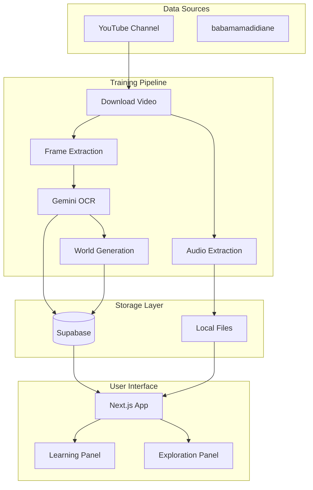

# Data Flow Architecture

This document describes the end-to-end data flow from YouTube videos to the learning interface.

## High-Level Flow



## Detailed Data Flow

### Stage 1: Video Acquisition

```
YouTube URL
     │
     ▼
┌─────────────┐
│   yt-dlp    │ ─────▶ Video file (.mp4)
└─────────────┘        Max 720p, ~100-200MB
```

**Input:** YouTube video URL
**Output:** Local video file
**Tools:** yt-dlp with multiple fallback strategies

### Stage 2: Frame Extraction

```
Video File
     │
     ▼
┌───────────────────────────────────────┐
│         SmartFrameExtractor           │
│  ┌─────────────┐  ┌────────────────┐  │
│  │   Scene     │  │   Perceptual   │  │
│  │  Detection  │  │    Hashing     │  │
│  └─────────────┘  └────────────────┘  │
│  ┌─────────────┐  ┌────────────────┐  │
│  │   Content   │  │     Even       │  │
│  │  Classifier │  │   Sampling     │  │
│  └─────────────┘  └────────────────┘  │
└───────────────────────────────────────┘
     │
     ▼
JPEG frames (50-100 per video)
```

**Input:** Video file
**Output:** Unique, representative frames
**Reduction:** ~50-70% fewer frames than naive extraction

### Stage 3: OCR Analysis

```
Frame Image
     │
     ▼
┌─────────────────────────────────────────┐
│            Gemini API                    │
│  Model: gemini-2.0-flash                 │
│                                          │
│  Input:  Image + N'Ko detection prompt   │
│  Output: JSON with:                      │
│    - has_nko_text: boolean               │
│    - nko_text: string                    │
│    - latin_transliteration: string       │
│    - english_translation: string         │
│    - confidence: float                   │
└─────────────────────────────────────────┘
     │
     ▼
Detection Record in Supabase
```

**Input:** JPEG frame
**Output:** Structured detection data
**Cost:** ~$0.002 per frame

### Stage 4: Audio Extraction

```
Video File + Scene Timestamps
     │
     ▼
┌─────────────────────────────────────────┐
│            FFmpeg                        │
│                                          │
│  1. Extract full audio (m4a)             │
│  2. Segment by scene timestamps          │
│  3. Create manifest.json                 │
└─────────────────────────────────────────┘
     │
     ▼
Audio segments + Manifest
```

**Input:** Video file, scene timestamps
**Output:** Scene-aligned audio segments
**Format:** M4A, 128kbps, 16kHz (speech-optimized)

### Stage 5: World Generation

```
N'Ko Detection
     │
     ▼
┌─────────────────────────────────────────┐
│         WorldGenerator                   │
│                                          │
│  For each detected phrase:               │
│    → Everyday context                    │
│    → Formal context                      │
│    → Storytelling context                │
│    → Proverbs context                    │
│    → Educational context                 │
└─────────────────────────────────────────┘
     │
     ▼
5 World Variants per phrase
```

**Input:** N'Ko text + translations
**Output:** 5 contextual variants
**Cost:** ~$0.0001 per world

### Stage 6: Database Storage

```
All Analysis Results
     │
     ▼
┌─────────────────────────────────────────┐
│            Supabase                      │
│                                          │
│  nko_sources      ← Video metadata       │
│  nko_frames       ← Frame records        │
│  nko_detections   ← OCR results          │
│  nko_trajectories ← World variants       │
│  nko_audio_segments ← Audio metadata     │
└─────────────────────────────────────────┘
```

### Stage 7: Frontend Delivery

```
Supabase Data
     │
     ▼
┌─────────────────────────────────────────┐
│         Next.js API Routes               │
│                                          │
│  /api/learning/stream  ← SSE streaming   │
│  /api/exploration/*    ← Exploration     │
│  /api/vocabulary/*     ← Vocabulary      │
└─────────────────────────────────────────┘
     │
     ▼
React Components → User Browser
```

## Data Relationships

```
Source (Video)
    │
    ├── Frame 1
    │      └── Detection A
    │             └── Trajectory (5 worlds)
    │                    ├── Node: Everyday
    │                    ├── Node: Formal
    │                    ├── Node: Storytelling
    │                    ├── Node: Proverbs
    │                    └── Node: Educational
    │
    ├── Frame 2
    │      └── Detection B
    │             └── Trajectory (5 worlds)
    │
    └── Audio Segment 1
           └── (Future: Transcription)
```

## Cost Flow

```
522 Videos × ~55 frames × $0.002/frame = $57 (OCR)
           ↓
~3000 unique phrases × 5 × $0.0001 = $2 (Worlds)
           ↓
522 × 60 min × $0.006/min = $188 (Optional ASR)
           ↓
Total: $60 (without ASR) or $247 (with ASR)
```

