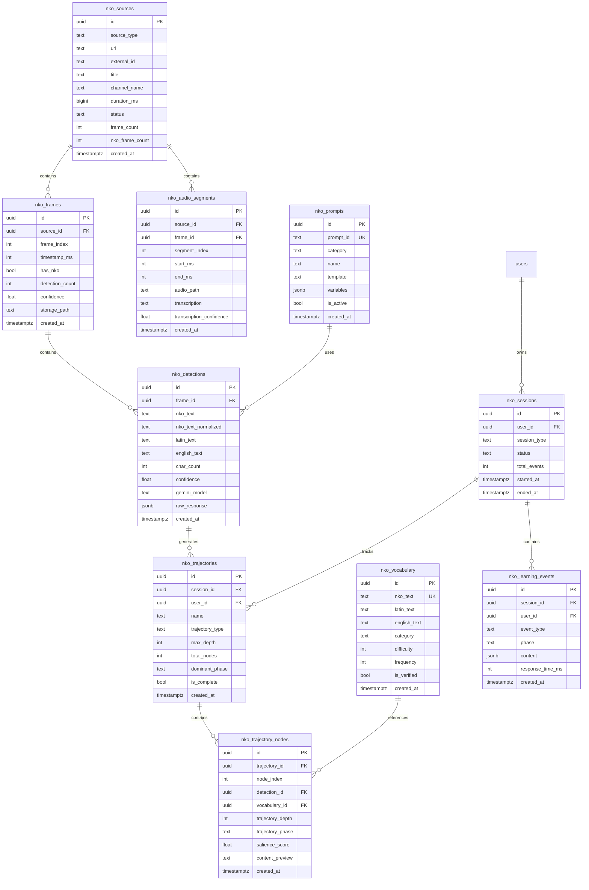

# Database Schema

This document describes the Supabase PostgreSQL schema for LearnN'Ko.

## Entity Relationship Diagram



## Table Descriptions

### Core Content Tables

#### `nko_sources`
Video source metadata from YouTube.

| Column | Type | Description |
|--------|------|-------------|
| id | UUID | Primary key |
| source_type | TEXT | 'youtube', 'file', 'upload' |
| url | TEXT | Full video URL |
| external_id | TEXT | YouTube video ID |
| title | TEXT | Video title |
| channel_name | TEXT | YouTube channel |
| duration_ms | BIGINT | Video duration |
| status | TEXT | 'pending', 'processing', 'completed', 'failed' |
| frame_count | INT | Total extracted frames |
| nko_frame_count | INT | Frames with N'Ko text |

#### `nko_frames`
Individual video frames.

| Column | Type | Description |
|--------|------|-------------|
| id | UUID | Primary key |
| source_id | UUID | FK to nko_sources |
| frame_index | INT | Position in video |
| timestamp_ms | INT | Timestamp in video |
| has_nko | BOOL | Contains N'Ko text |
| detection_count | INT | Number of detections |
| confidence | FLOAT | Average confidence |
| storage_path | TEXT | Path to frame image |

#### `nko_detections`
OCR results for N'Ko text.

| Column | Type | Description |
|--------|------|-------------|
| id | UUID | Primary key |
| frame_id | UUID | FK to nko_frames |
| nko_text | TEXT | Raw N'Ko text |
| nko_text_normalized | TEXT | Normalized for matching |
| latin_text | TEXT | Latin transliteration |
| english_text | TEXT | English translation |
| char_count | INT | Character count |
| confidence | FLOAT | OCR confidence |
| gemini_model | TEXT | Model used |
| raw_response | JSONB | Full API response |

#### `nko_audio_segments`
Scene-aligned audio for future ASR.

| Column | Type | Description |
|--------|------|-------------|
| id | UUID | Primary key |
| source_id | UUID | FK to nko_sources |
| frame_id | UUID | FK to nko_frames (optional) |
| segment_index | INT | Position in video |
| start_ms | INT | Start timestamp |
| end_ms | INT | End timestamp |
| audio_path | TEXT | Path to audio file |
| transcription | TEXT | ASR result (future) |
| transcription_confidence | FLOAT | ASR confidence |

### Learning Tables

#### `nko_trajectories`
Learning paths through content.

| Column | Type | Description |
|--------|------|-------------|
| id | UUID | Primary key |
| session_id | UUID | FK to nko_sessions |
| user_id | UUID | FK to users |
| name | TEXT | Trajectory name |
| trajectory_type | TEXT | 'content_flow', 'exploration' |
| total_nodes | INT | Number of nodes |
| dominant_phase | TEXT | Primary learning phase |
| is_complete | BOOL | Fully traversed |

#### `nko_trajectory_nodes`
Individual steps in a trajectory.

| Column | Type | Description |
|--------|------|-------------|
| id | UUID | Primary key |
| trajectory_id | UUID | FK to nko_trajectories |
| node_index | INT | Position in trajectory |
| detection_id | UUID | FK to nko_detections |
| vocabulary_id | UUID | FK to nko_vocabulary |
| trajectory_depth | INT | Nesting depth |
| trajectory_phase | TEXT | 'exploration', 'consolidation', etc. |
| salience_score | FLOAT | Importance score |
| content_preview | TEXT | Preview text |

#### `nko_vocabulary`
Curated vocabulary entries.

| Column | Type | Description |
|--------|------|-------------|
| id | UUID | Primary key |
| nko_text | TEXT | N'Ko text (unique) |
| latin_text | TEXT | Transliteration |
| english_text | TEXT | Translation |
| category | TEXT | Word category |
| difficulty | INT | 1-5 difficulty |
| frequency | INT | Usage frequency |
| is_verified | BOOL | Human verified |

### Session Tables

#### `nko_sessions`
User learning sessions.

| Column | Type | Description |
|--------|------|-------------|
| id | UUID | Primary key |
| user_id | UUID | FK to users |
| session_type | TEXT | 'learning', 'exploration' |
| status | TEXT | 'active', 'completed' |
| total_events | INT | Event count |
| started_at | TIMESTAMPTZ | Start time |
| ended_at | TIMESTAMPTZ | End time |

#### `nko_learning_events`
Individual learning interactions.

| Column | Type | Description |
|--------|------|-------------|
| id | UUID | Primary key |
| session_id | UUID | FK to nko_sessions |
| user_id | UUID | FK to users |
| event_type | TEXT | 'view', 'response', 'correction' |
| phase | TEXT | Learning phase |
| content | JSONB | Event details |
| response_time_ms | INT | User response time |

### Configuration Tables

#### `nko_prompts`
Dynamic prompt templates.

| Column | Type | Description |
|--------|------|-------------|
| id | UUID | Primary key |
| prompt_id | TEXT | Unique identifier |
| category | TEXT | 'ocr', 'world', 'live' |
| name | TEXT | Human-readable name |
| template | TEXT | Prompt template |
| variables | JSONB | Expected variables |
| is_active | BOOL | Currently active |

## Row Level Security

All tables use RLS with policies:

```sql
-- Public read access
CREATE POLICY "Public read" ON table_name
FOR SELECT TO public USING (true);

-- Service role write access
CREATE POLICY "Pipeline insert" ON table_name
FOR INSERT TO service_role WITH CHECK (true);

-- User-owned data
CREATE POLICY "Users own their data" ON user_table
FOR ALL TO authenticated
USING (auth.uid() = user_id);
```

## Indexes

Key indexes for performance:

```sql
-- Source lookups
CREATE INDEX idx_sources_external_id ON nko_sources(external_id);
CREATE INDEX idx_sources_status ON nko_sources(status);

-- Frame queries
CREATE INDEX idx_frames_source ON nko_frames(source_id);
CREATE INDEX idx_frames_has_nko ON nko_frames(has_nko) WHERE has_nko = true;

-- Detection searches
CREATE INDEX idx_detections_frame ON nko_detections(frame_id);
CREATE INDEX idx_detections_nko_text ON nko_detections USING gin(to_tsvector('simple', nko_text));

-- Vocabulary lookups
CREATE UNIQUE INDEX idx_vocabulary_nko_text ON nko_vocabulary(nko_text);
```

## Migration Files

| File | Description |
|------|-------------|
| 001-005 | Core tables (sources, frames, detections) |
| 006-007 | Learning tables (sessions, events, trajectories) |
| 008-009 | Vocabulary and statistics |
| 010 | Prompt registry |
| 011 | Pipeline insert policies |
| 012 | Audio segments |

